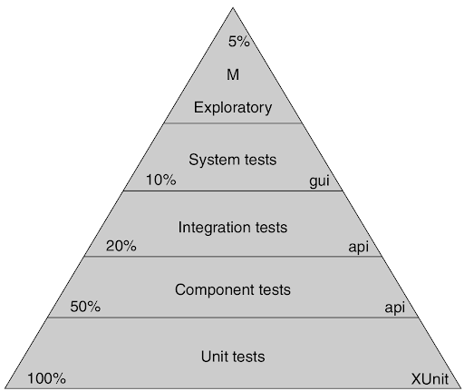

# Summary of "The Clean Coder" by Robert C. Martin 

> This list of main statements from the book serves for quick look up after reading to refresh the memory. 
This list doesn't try to substitute reading the book.
Reading the book is necessary to understand some points and eliminate possible ambiguity.

## 1. Professionalism
    
### Taking Responsibility
- Take responsibility and accountability.
- Imagine sometimes that it is your own money burned due to a bug.
- As a professional when you make a mistake, you must clean up the mess.

### Do not harm
- Practise merciless refactoring - remember the Boy Scout rule.
- Software is too complex to create without bugs.
- QA should find nothing.
- You must known it works.
- You must to be able to execute tests on a whim.
- If you want your software to be flexibly, you have to flex it! 
The only way to prove that your software is easy to change to make easy changes to it.

### Work Ethic
- Commit the principles and patterns of software design to memory and strive to conform your software to them.
- It is not your employer's responsibility to give you time you need to learn.
- Do not entrust your career to your employer.
- 40 hours a week are for your employer / 20 hours a week are for you.
- Be conversant with:
    - Design patterns: GOF book, POSA book;
    - Design principles: SOLID;
    - Methods: XP, Scrum, Lean, Kaban, Waterfall, Structured Analysis, Structured Design;
    - Disciplines: TDD, OOD, CI;
    - Artifacts: UML, DFDs, Petri Nets, State Transition Diagrams and Tables.
- Do not stop learning.
- Do not stop practicing.
- Collaborate.
- Be a mentor.
- Know your domain.
- Identify with employer/customer.
- Be humble.
- Never demean another for making a mistake.
- Never ridicule others.

## 2. Saying No
    
### Adversarial Roles
- Professionals speak truth to power.
- Do not hesitate to say no and face confrontation, 
the hard decisions are best made through the confrontation of adversarial roles.
- Do not provide too much details in case of adversarial conversation as it can be an invitation for micro-management.

### High Stakes
- The most important time to say no is when the stakes are highest.
- The higher the stakes, the more valuable "no" becomes.

### Being a "Team Player"
- Keen on being a team player.
- Use every means in your power to help teammates, managers and customer.
- Forget about trying. Either you do or you do not.
- Be open, there is no place or time for passive aggression.

### The Cost of Saying Yes
- Strive to find a way to say YES. But remember that sometimes the only way to get to the right yes is to be unafraid to say no.
- The clients never care as much as you do.

### Code Impossible
- Do not be tempted to be a hero or jedi.
- Never drop your disciplines. It is not the way to solve problems.
- Good code and professionalism are possible.

## 3. Saying Yes

### A Language of Commitment
- Make a commitment effectively:
    1. You say you'll do it.
    2. You mean it.
    3. You actually do it.
- Recognize lack of commitment around you, and in you.
- Change your language of commitment to solve the communication problem.
- Professionals live up to their words.

### Learning How to Say "Yes"
- Instead of committing to do impossible work (or if it depends on someone else), you should commit to these specific actions that bring you closer to the end goal.
- Change expectations as soon as possible.
- Do not abuse the word try. Say it clear, either you will or you wont.
- Do not break disciplines, it only slows you down.
- All commitments we make should be subordinate to the committed disciplines.
- Professionals know their limits.

## 4. Coding

### Preparedness
- Firstly, you must understand what problem you are solving. 
- Secondly, you must understand how to solve that problem.
- Your code must fit well into the existing system.
- You must craft the code in such a way that it reveals your intent.

### Interruptions
- If you are tired or destructed, do not code. Dedication and professionalism are more about discipline that hours.
- Professional developers allocate their personal time in order to ensure that the time spent at office is as productive as possible.
- The professional attitude is a polite willingness to be helpful.

### Creativity
- Remember that creativity breeds creativity.

### Debugging
- It is incumbent upon you as a professional to reduce your debugging time as close to zero as you can get.

### Pacing Yourself
- You must conserve your energy and creativity with the same care.
- Learn your patterns of creativity and brilliance, and take advantage of them rather than work against them.
- Disengagement allows your mind to hunt for solutions in a different and more creative way.
- Sometimes the best way to solve a problem is to go home, eat dinner, watch TV, go to bed, and then wake up the next morning and take a shower.

### Being Late
- Do not incorporate hope into your estimates. Hope is a project killer.
- Do not let anyone else have hope.
- Hold your estimates.
- Do not be tempted to rush.
- Never buckle under pressure and agree to try to make the deadline.
- You should not agree to work unless
    1. You can personally afford it;
    2. It is short term, two weeks or less;
    3. Your boss/manager has a fall-back plan in case the overtime effort fails.
 - Avoid the problem of false delivery by creating an independent definition of "done".
 
### Help
 - No matter how skilled you are, you will certainly benefit from another programmer's thoughts and ideas.
 - As a professional you are honor bound to offer that help whenever it is needed.
 - Fresh perspective can be a profound catalyst for solving problems.
 - As you are honor bound to offer help, you are honor bound to accept help. Be gracious about it.
 - It is unprofessional to remain stuck when help is easily accessible.
 - As a professional you should train less experienced programmers. 
 
## 5. Test Driven Development

### The Jury Is In
- TDD works.

### The Three Laws of TDD
- You are not allowed to write any production code until you have first written a failing unit test.
- You are not allowed to write more of a unit test than is sufficient to fail - and not compiling is failing.
- You are not allowed to write more production code that is sufficient to pass the current failing unit test.

### The Litany Of Benefits
- *Certainty*. You will write dozens of tests every day. If you keep all of them on hand, you will be certain that your code really works.
- *Defect Injection Rate*. There are several facts of defect reduction by IBM, Microsoft and other companies.
- *Courage*. When you have a suit of tests that you trust, then you lose all fear of making changes and cleaning code.
- *Documentation*. The unit tests are documents that describe the lowest-level design of the system.
- *Design*. The need to test first forces you to think about good design.

### What TDD Is Not
- You can still write bad code even if you write your tests first, you can write bad tests.
- No professional developer should ever follow a discipline when that discipline does more harm than good.

## 6. Practicing
- Again, never stop practicing.
- Practice on your own time. It is not your employer job to help you to keep your skills sharp for you.

### The Coding Dojo
- Doing anything quickly requires practice.
- Choose a repertoire of problem/solution paris and execute them over and over again until you know them cold.
- Practice Kata.
- Practise Wasa.
- Practise Randori.

### Broadening Your Experience
- Diverse your experience.
- Contribute to an open-source project.
- Do not use the same language or platform that you use at work.

## 7. Acceptance Testing

### Communicating Requirements
- Remember that a vision of features does not often survive actual contact with the computer.
- Do not succumb to temptation to fall into the trap of premature precision.
- Follow The Uncertainty Principle: The more precise you make your requirements, the less relevant they become as the system is implemented. 
- The uncertainty principle makes hash out of early precision. The requirements _will_ change making that precision moot.
- You must make estimates based on low precision requirements and recognize that those estimates _are estimates_.
- Always include error bars with the estimates so that the business understands the uncertainty (see Chapter 10).
- The solution to premature precision is to defer precision as long as possible and eliminate _late ambiguity_.
- It's your responsibility to make sure that all ambiguity is removed from the requirements.

### Acceptance Tests 
- Acceptance tests define when a requirement is done. They allow you to to know then you are done.
- _Done_ means all code written, all tests pass, QA and stakeholders have accepted. Done.
- You must work with stakeholders and QA to ensure that the automated tests are a complete specification of done.
- You must ensure that all parties know what is about to be built.
- Acceptance tests should _always_ be automated. The reason is simple: cost.
- It's your job (as a developer) to connect the acceptance tests to the system, and then to make those tests pass.
- It's your job to negotiate with the test author for a better test.
- Never take the passive-aggressive option and say to yourself, "Well, that's what the test says, so that's what I'm going to do".
- The primary purpose of acceptance tests is to formally document the design, structure, and behavior of the system. They are written by the business for the business.
- Test through the right interface. Separate testing of business rules from testing GUI. 
- Keep the GUI tests to a minimum. They are fragile, because the GUI is volatile.
- Include the acceptance tests into CI/CD systems.
- A broken build in the CI system should be viewed as an emergency, as "stop the presses" event.

## 8. Testing Strategies

### QA Should Find Nothing
- It's your goal as a professional developer that QA find nothing wrong.
- QA and development team should be working together.
- QA team gather the requirements from the business and writes the corner, boundary, and unhappy-path tests.
- QA team should identify the actual behavior of the system and report it back to development and business.

### The Test Automation Pyramid

#### Unit Tests
- Intended to specify system at the lowest level.
- Written by developers for developers, in programming language of the system.
- Cover unhappy-path cases as well.
- Executed as part of CI/CD

#### Component Tests
- Intended to be read and interpreted by business.
- Written by QA and Business with assistance from development.
- Cover component functionality only with mocking and test-doubling dependencies.
- Executed as part of CI/CD

#### Integration Tests
- Written by developers.
- Cover the architectural structure of the system, not business rules. 
  Ensure that all components connected and clearly communicate with each other.
- Can include throughout and performance tests.
- Executed periodically (nightly, weekly, etc.). 

#### System Tests
- Written by architects and tech leads.
- The ultimate integration tests.
- Ensure correct system construction.

#### Manual Exploratory Tests
- Performed by everyone manually.
- Ensure that system behaves well under human operation.
- Give a way to creatively find as many bugs as possible.

## 9. Time Management

### Meetings
- Meetings are necessary and huge time wasters. 
- Meetings spend not only your time but also your project's time,
 your employer's time, your employer's  money.
- Remember that it's only you who is responsible for managing your time.

#### Declining
- You should politely resist attending meetings that don't have an immediate 
 and significant benefit for your job you are doing now.
- Ask your team and manager for help to decide whether you should attend a meeting.
- One of the most important duties of your manager is to keep you out of meetings.

#### Leaving
- When the meeting gets boring, leave. Find a way to politely exit that meeting.

#### Have an Agenda and a Goal
- Make sure you know agenda, and a goal of a meeting you are asked to go. 
- If the agenda has been high jacked during the meeting, request that the new topic be tabled and the agenda be followed.

#### Stand-Up Meetings
- Each participant should require no more than **one minute** to answer the questions:
    - What did I do yesterday?
    - What am I going to do today?
    - What's in my way?

#### Iteration Planning Meetings
- Select the backlog items that will be executed in the next iteration.
    - Estimates should already be done.
    - Assessment of business value should already be done.
    - (In really good orgs) The acceptance/component tests should already be written or sketched out.
- Discuss briefly each candidate backlog item and then either select or reject it.
    - No more than 5-10 minutes on each item.
- Ideally, this meeting should take no more than 5% of the total work time in the iteration.

#### Iteration Retrospective and Demo
- Iteration Retrospective
    - Conducted at the end of each iteration.
    - Discuss what went right and what went wrong.
    - No more than 20 minutes.
- Demo
    - Stakeholders see a demo of the newly working features.
    - No more than 25 minutes.
- Schedule them before quitting time on the last day of the iteration.
- Remember, it's only been a week or two so there shouldn't be all that uch to talk about.

#### Arguments/Disagreements
- :tbd